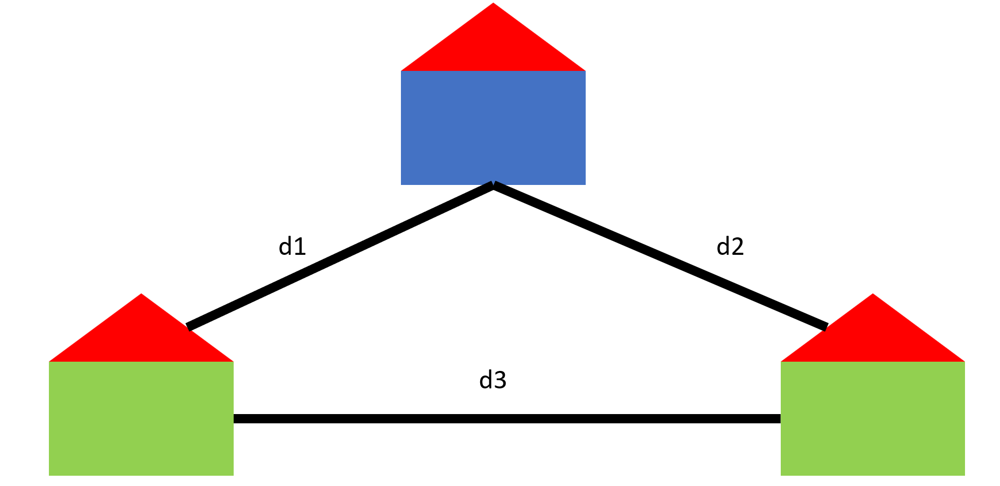
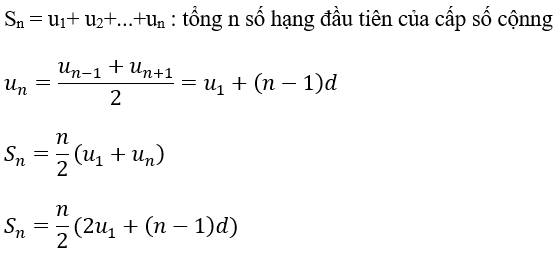
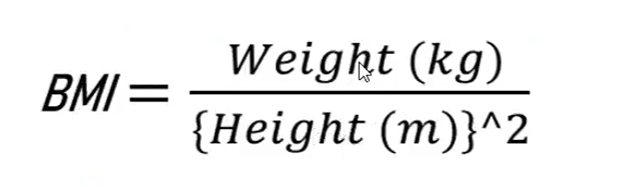

# 01: Tính toán giá trị của biểu thức

Cho biểu thức A(x) = x^3 + 3x^2 + x + 1 Với giá trị của x được nhập từ bàn phím, tính và in ra giá trị của biểu thức trên.

**Input Format.**

Số nguyên x.

**Constraints.**

-10^5 < x < 10^5.

**Output Format.**

In ra kết quả cùa biểu thức.

**Sample Input 0.**

```
2
```

***Sample Output 0.***

```
23
```

```cpp
// loi giai
#include <iostream>
using namespace std;

int main() {
	int x;
	cin >> x;
	cout << 1ll * x * x * x + 3ll * x * x + x + 1 << endl;
	return 0;
}
```

# 02: Tính toán giá trị của biểu thức 2

Yêu cầu: Cho ba số nguyên a, b và c, hãy tính S = a*(b+c)+b*(a+c).

**Input Format.**

3 số a, b, c trên 1 dòng.

**Constraints.**

-10^8 < a, b, c < 10^8.

**Output Format.**

In ra giá trị của biểu thức.

**Sample Input 0.**

```
1 2 3
```

***Sample Output 0.***

```
13
```

```cpp
// loi giai
#include <iostream>
using namespace std;

int main() {
	long long a, b, c;
	cin >> a >> b >> c;
	cout << a * (b + c) + b * (a + c);
	return 0;
}
```

# 03: Tính tổng, hiệu, tích, thương

Nhập vào 2 sô nguyên, in ra tổng, hiệu, tích, thương (lấy độ chính xác với 4 chữ số) của 2 số đó. Bài này có thể bị sai do 2 nguyên nhân: `1.` Khi tính tích bị tràn số, `2.` Độ chính xác của thương.

**Input Format.**

2 số nguyễn a, b trên 1 dòng.

**Constraints.**

-10^8 < a,b < 10^8. 

**Output Format**

In ra tổng, hiệu, tích, trương trên từng dòng, Nếu trường hợp không thế tìm được thương của 2 số thì sẽ in ra "INVALID" cho dòng kết quả của thương.

**Sample Input 0.**

```
7769 0
```

***Sample Output 0.***

```
7769
7769
0
INVALID
```


***Sample Input 1.***

```
9794 1282
```

***Sample Output 1.***

```
11076
8512
12555908
7.6396
```

```cpp
// loi giai
#include <iostream>
#include <iomanip>
using namespace std;

int main() {
	int a, b;
	cin >> a >> b;
	cout << a + b << endl << a - b << endl << 1ll * a * b << endl;
	if (b == 0) cout << "INVALID";
	else {
		cout << fixed << setprecision(4) << 1.0 * a / b << endl;
	}
	return 0;
}
```

# 04: Tính chu vi và diện tích hình tròn

Cho bán kính R của hình tròn. Yêu câu tính chu vi và diện tích của hình tròn đó.

**Input Format.**

1 dòng chứa bán kính R là số nguyên dương.

**Conetraints.**

1 <= R <= 1000.

**Output Format.**

In ra chu vi và diện tích trên 1 dòng, kết quả lấy chính xác 4 số sau dấy phẩy (PI = 3.14).

**Sample Input 0.**

```
10
```

**Sample Output 0.**

```
62.8000 314.0000
```

```cpp
// loi giai
#include <iostream>
#include <iomanip>
using namespace std;

#define PI 3.14

int main() {
	double a; cin >> a;
	cout << fixed << setprecision(4) << 2 * PI * a << " ";
	cout << fixed << setprecision(4) << PI * a * a << endl;
	return 0;
}
```

# 05: Khoảng cách 2 tọa độ

Có nhiều khoảng cách giữa 2 điểm trong hệ tọa độ ví dụ như khoảng cách Manhattan, Euclid, Minkowski. Nhưng trong chương trình toán phố thông các bạn sử dụng nhiều nhất là khoảng cách Euclid. Vì vậy bạn hãy tính khoảng cách Euclid giữa 2 điểm trong hệ tọa độ Oxy.

**Input Format.**

Tọa độ của 2 điểm (x1, y1) và (x2, y2) là các số nguyên.

**Constraints.**

-10^6 < xi, yi < 10^6.

**Output Format.**

In ra khoảng cách giữa 2 điểm, lấy độ chính xác 2 số sau dấu phẩy.

**Sample Input 0.**

```
1 4 4 8
```

**Sample Output 0.**

```
5.00
```

```cpp
// loi giai
#include <iostream>
#include <iomanip>
using namespace std;

int main() {
	double x1, y1, x2, y2;
	cin >> x1 >> y1 >> x2 >> y2;
	cout << fixed << setprecision(2) << sqrt(pow(x1 - x2, 2) + pow(y1 - y2, 2)) << endl;
	return 0;
}
```

# 06: Chuyển đổi nhiệt độ

Công thức chuyến đơn vị đo nhiệt độ từ C sang như sau: F = (C * 9 / 5) + 32 Viết chương trình C cho phép nhập vào nhiệt độ đo theo độ C là số nguyên dương không quá 106, thực hiện chuyển sang đơn vị đo độ F và in ra màn hình. (Lưu ý luôn lấy 2 chữ số thập phân sau dấu chấm phẩy).

**Input Format.**

Nhiệt độ ở độ C là một số nguyên không âm.

**Constraints.**

0 <= n <= 100.

**Output Format.**

Kết quả đối từ độ C sang độ F.

**Sample Input 0.**

```
24
```

**Sample Output 0.**

```
75.20
```

```cpp
// loi giai
#include <iostream>
#include <iomanip>
using namespace std;

int main() {
	int x; cin >> x;
	cout << fixed << setprecision(2) << (1.0 * x * 9 / 5) + 32 << endl;
	return 0;
}
```

# 07: Tìm số chia hết

Cho 2 số nguyên a và b. Bạn hãy tìm 2 số sau số thứ 1 là số lớn nhất <= a mà chia hết cho b, số thứ 2 là số nhỏ nhất >= a mà chia hết cho b. Chú ý các bạn không được dùng vòng lặp.

**Input Format.**

1 dòng chứa 2 số a, b.

**Constraints.**

1 <= a, b <= 10^6.

**Output Format.**

Dòng đầu tiên in ra số thứ 1 cần tìm. Dòng thứ 2 in ra số thứ 2 cần tìm.

**Sample Input 0.**

```
717 689
```

**Sample Output.**

```
689
1378
```

```cpp
// loi giai
#include <iostream>
#include <iomanip>
using namespace std;

int main() {
	int a, b;
	cin >> a >> b;
	cout << a / b * b << endl << (a + b - 1) / b * b;
	return 0;
}
```

# 08: Viết điều kiện

Cho một số nguyên không âm N. Bạn hãy thực hiện viết câu lệnh để kiếm tra các điều kiện sau: `1.` N có phải là số chẵn? `2.` N có phải là số vừa chia hết cho 3 vừa chia hết cho 5? `3.` N có phải là số chia hết 3 nhưng không chia hết cho 7? `4.` N có phải là số chia hết cho 3 hoặc 7? `5.` N là số lớn hơn 30 và nhỏ hơn 50? `6.` N có phải là số không nhỏ hơn 30 và chia hết cho ít nhất một trong 3 số 2, 3, 5? `7.` N có phải là số có 2 chữ số có chữ tận cùng là một số nguyên tố? `8.` N có phải là số không vượt quá 100 và chia hết cho 23? `9.` N không thuộc đoạn [10, 20]? `10.` N có chữ số tận cùng là bội số của 3?

**Input Format.**

Số nguyên dương N.

**Constraints.**

1 <= N <= 10^6.

**Output Format.**

In ra 10 dòng, mỗi dòng là `YES` hoặc `NO` tương ứng với 10 điều kiện. Nếu N thỏa mãn điều kiện thứ i thì dòng i in ra `YES`, ngược lại in ra `NO`.

**Sample Input 0.**

```
263
```

**Sample Output 0.**

```
NO
NO
NO
NO
NO
NO
NO
NO
YES
YES
```

```cpp
// loi giai
#include <iostream>
#include <iomanip>
using namespace std;

int main() {
	int n; cin >> n;
	if (n % 2 == 0) cout << "YES" << endl;
	else cout << "NO" << endl;

	if (n % 3 == 0 && n % 5 == 0) cout << "YES" << endl;
	else cout << "NO" << endl;

	if (n % 3 == 0 && n % 7 != 0) cout << "YES" << endl;
	else cout << "NO" << endl;

	if (n % 3 == 0 || n % 7 == 0) cout << "YES" << endl;
	else cout << "NO" << endl;

	if (n > 30 && n < 50) cout << "YES" << endl;
	else cout << "NO" << endl;

	if (n >= 30 && (n % 2 == 0 || n % 3 == 0 || n % 5 == 0)) cout << "YES" << endl;
	else cout << "NO" << endl;

	if (n > 9 && n < 100 && (n % 10 == 2 || n % 10 == 3 || n % 10 == 5 || n % 10 == 7)) cout << "YES" << endl;
	else cout << "NO" << endl;

	if (n <= 100 && n % 23 == 0) cout << "YES" << endl;
	else cout << "NO" << endl;

	if (n < 10 || n > 20) cout << "YES" << endl;
	else cout << "NO" << endl;

	if (n % 10 == 0 || n % 10 == 3 || n % 10 == 6 || n % 10 == 9) cout << "YES" << endl;
	else cout << "NO" << endl;

	return 0;
}
```

# 09: Kiểm tra năm nhuận

Năm nhuận là năm chia hết cho 400 hoặc (chia hết cho 4 và không chia hết cho 100). Nhập vào N là một năm và kiểm tra xem N có phải là năm nhuận hay không?

**Input Format.**

Số nguyên dương N.

**Constraints.**

1 <= N <= 5000.

**Output Format.**

In ra `YES` nếu N là năm nhuận, ngược lại in ra `NO`.

**Sample Input 0.**

```
2020
```

**Sample Output 0.**

```
YES
```

```cpp
// loi giai
#include <iostream>
#include <iomanip>
using namespace std;

int main() {
	int n; cin >> n;
	if (n % 400 == 0 || (n % 4 == 0 && n % 100 != 0)) cout << "YES" << endl;
	else cout << "NO" << endl;
	return 0;
}
```

# 10: Kiểm tra tam giác

Cho 3 cạnh a, b, c là độ dài 3 cạnh của tam giác, kiểm tra xem a, b, c có thế tạo thành một tam giác hợp lệ hay không?

**Input Format.**

1 dòng chứa 3 số a, b, c.

**Constraints.**

-10^6 <= a, b, c <= 10^6.

**Output Format.**

In ra `YES` nếu a, b, c là 3 cạnh của 1 tam giác hợp lệ, ngược lại in ra `NO`.

**Sample Input 0.**

```
3 4 5
```

**Sample Output 0.**

```
YES
```

```cpp
// loi giai
#include <iostream>
#include <iomanip>
using namespace std;

int main() {
	double a, b, c; cin >> a >> b >> c;
	if (a > 0 && b > 0 && c > 0 && a + b > c && b + c > a && a + c > b) cout << "YES" << endl;
	else cout << "NO" << endl;
	return 0;
}
```

# 11: Xác định loại tam giác

Cho 3 cạnh a, b, c của một tam giác, nếu tam giác đã cho là tam giác đều thì in ra 1, tam giác cân thì in ra 2, tam giác vuông thì in ra 3, tam giác thường thì in ra 4, trường hợp tam giác nhập vào không hợp lệ thì in ra `INVALID`.

**Input Format.**

1 dòng chứa 3 số a, b, c.

**Constraints.**

0 <= a, b, c <= 10^3.

**Output Format.**

In ra kết quả tương ứng.

**Sample Input 0.**

```
8 8 8
```

**Sample Output 0.**

```
1
```

```cpp
// loi giai
#include <iostream>
#include <iomanip>
using namespace std;

int main() {
	double a, b, c; cin >> a >> b >> c;
	if (a > 0 && b > 0 && c > 0 && a + b > c && b + c > a && a + c > b) {
		if (a == b && b == c) cout << "1" << endl;
		else if (a == b || b == c || a == c) cout << "2" << endl;
		else if (a * a + b * b == c * c || a * a + c * c == b * b || c * c + b * b == a * a) cout << "3" << endl;
		else cout << "4" << endl;
	}
	else cout << "INVALID" << endl;
	return 0;
}
```

# 12: In số ngày trong tháng

Cho biết tháng và năm, hãy in ra số ngày tương ứng có trong tháng đó. Chú ý tháng 2 của năm nhuận có 29 ngày.

**Input Format.**

2 số nguyên t và n tương ứng với tháng và năm.

**Constraints.**

0 <= t <= 100; 0 <= n <= 5000.

**Output Format.**

Nếu tháng là hợp lệ(tháng 1 tới 12) và năm là hợp lệ (lớn hơn 0) thì in ra số ngày tương ứng của năm đó, ngược lại in ra `INVALID`.

**Sample Input 0.**

```
11 2021
```

**Sample Output 0.**

```
30
```

```cpp
// loi giai
#include <iostream>
#include <iomanip>
using namespace std;

int main() {
	int a, b; cin >> a >> b;
	if (a > 0 && a < 13 && b > 0) {
		if (a == 1 || a == 3 || a == 5 || a == 7 || a == 8 || a == 10 || a == 12) cout << 31 << endl;
		else if (a == 4 || a == 6 || a == 9 || a == 11) cout << 30 << endl;
		else {
			if (b % 400 == 0 || (a % 4 == 0 && a % 100 != 0)) cout << 29 << endl;
			else cout << 28 << endl;
		}
	}
	else cout << "INVALID" << endl;
}
```

# 13: Quy đổi sang năm, tháng, ngày

Cho trước N ngày, hãy đổi N thành số năm, số Ứn số ngày. Biết răng một năm có 365 ngày.

**Input Format.**

Số nguyên không âm N.

**Constraints.**

0 <= N <= 1000000.

**Output Format.**

In ra số năm, tuần, ngày tương ứng với N ngày

**Sample Input 0.**

```
373
```

**Sample Output 0.**

```
1 1 1
```

```cpp
// loi giai
#include <iostream>
#include <iomanip>
using namespace std;

int main() {
	int n; cin >> n;
	cout << n / 365 << " " << (n % 365) / 7 << " " << (n % 365) % 7 << endl;
	return 0;
}
```

# 14: Kiểm tra kí tự

Cho một kí tự, bạn hãy kiểm tra kí tự nhập vào in thường, chữ số hay kí tự đặc biệt (các kí tự không phải là chữ cái và chữ số).

**Input Format.**

1 dòng chứa kí tự c.

**Constraints.**

c là chữ in hoa, in thường, chữ số hoặc kí tự đặc biệt.

**Output Format.**

Nếu c là chữ cái in hoa in ra `UPPER`. Nếu c là chữ cái in thường in ra `LOWER`. Nếu c là chữ số in ra `DIGIT`. Nếu c là kí tự đặc biệt in ra `SPECIAL`.

**Sample Input 0.**

```
Z
```

**Sample Output 0.**

```
UPPER
```

```cpp
// loi giai
#include <iostream>
#include <iomanip>
using namespace std;
// az 97 122
// AZ 65 90
// 09 48 57
int main() {
	char a; cin >> a;
	if (a >= 'a' && a <= 'z') cout << "LOWER" << endl;
	else if (a >= 'A' && a <= 'Z') cout << "UPPER" << endl;
	else if (a >= '0' && a <= '9') cout << "DIGIT" << endl;
	else cout << "SPECIAL" << endl;
	return 0;
}
```

# 15: Kí tự kế tiếp

Cho kí tự là chữ cái in hoa hoặc in thường, in ra kí tự kế tiếp sau nó trong bảng chữ cái ở dạng in thường, tức là kí tự nhập vào ở dạng in hoa hay in thường thì bạn đều in ra kí tự kế tiếp nó nhưng ở dạng in thường. Coi kí tự kế tiếp của của chữ Z là chữ A.

**Input Format.**

1 dòng chứa kỉ tự c.

**Constraints.**

c là chữ cái in hoa hoặc in thường.

**Output Format.**

In ra chữ cái kế tiếp ở dạng in thường.

**Sample Input 0.**

```
A
```

**Sample Output 0.**

```
b
```

**Sample Input 1.**

```
z
```

**Sample Output 1.**

```
a
```

```cpp
// loi giai
#include <iostream>
#include <iomanip>
using namespace std;
// az 97 122
// AZ 65 90
// 09 48 57
int main() {
	char a; cin >> a;
	if (a == 'z' || a == 'Z') cout << "a" << endl;
	else if (a >= 'a' && a <= 'z') cout << (char)(a + 1) << endl;
	else if (a >= 'A' && a <= 'Z') cout << (char)(a + 33) << endl;
	else return 0;
	return 0;
}
```
# 16: Xếp loại học lực

Yêu cầu: Cho biết điểm kiểm tra Tin học của 1 em học sinh (2 con điểm hệ số 1, 1 con điểm hệ số 2, 1 con điểm hệ số 3). In ra Kết quả học tập môn Tin học của em đó. Nếu điểm tổng kết >= 8 đạt kết quả Giỏi, <8 và >= 6,5 đạt kết quả Khá, < 6,5 và >= 5 đạt kết quả Trung Bình, < 5 đạt kết quả Yếu.

**Input Format.**

Một dòng chứa 4 số điếm của học sinh.

**Constraints.**

Điểm là số thực từ 0 tới 10.

**Output Format.**

Kết quả học tập môn Tin học của em học sinh ở dạng in hoa không dấu.

**Sample Input 0.**

```
9 8 7 8.5
```

**Sample Output 0.**

```
GIOI
```

```cpp
// loi giai
#include <iostream>
using namespace std;

int main() {
	double a, b, c, d; cin >> a >> b >> c >> d;
	double kq = (a + b + 2 * c + 3 * d) / 7;
	if (kq >= 8) cout << "GIOI" << endl;
	else if (kq >= 6.5) cout << "KHA" << endl;
	else if (kq >= 5) cout << "TRUNG BINH" << endl;
	else cout << "YEU" << endl;
	return 0;
}
```

# 17: Domino

Bạn được cung cấp một bảng hình chữ nhật có kích thước M x N hình vuông đơn vị. Ngoài ra, bạn được cung cấp một số lượng không giới hạn các mảnh domino tiêu chuẩn kích thước 2 x 1. Bạn được phép xoay các mảnh domino. Bạn được yêu cầu đặt càng nhiều domino càng tốt trên bảng để đáp ứng các điều kiện sau: 1. Mỗi domino hoàn toàn bao gồm hai hình vuông đơn vị. 2. Không có hai domino trùng nhau. 3. Mỗi domino nằm hoàn toàn bên trong bảng. Nó được phép chạm vào các cạnh của bảng. Tìm số lượng domino tối đa thỏa mãn điều kiện trên.

**Input Format.**

2 số nguyên dương M và N.

**Constraints.**

1 <= M, N <= 10^9.

**Output Format.**

In ra số thanh domino cân thiết.

**Sample Input 0.**

```
3 3
```

**Sample Output 0.**

```
4
```

```cpp
// loi giai
#include <iostream>
using namespace std;

int main() {
	long long a, b; cin >> a >> b;
	if (a % 2 == 0) cout << a * b / 2 << endl;
	else cout << a * b / 2 + b / 2 << endl;
	return 0;
}
```

# 18: Lát gạch

Quảng trường Nhà hát ở thủ đô Berland có hình chữ nhật với kích thước n x m mét. Nhân dịp kỷ niệm thành phố, một quyết định đã được đưa ra để lát Quảng trường bằng những viên bảng đá granit vuông. Mỗi viên đá hình vuông có kích thước a x a. Số lượng viên đá ít nhất cần thiết để lát Quảng trường là bao nhiêu? Nó được phép che phử bề mặt lớn hơn Quảng trường Nhà hát. Nó không được phép phá vỡ các viên đá. Các cạnh của viên đá phải song song với các cạnh của Quảng trường.

**Input Format.**

3 số nguyên dương n, m, a.

**Constraints.**

1 <= n, m, a <= 10^9.

**Output Format.**

Viết số lượng viên đá cần thiết để lát kín quảng trường.

**Sample Input 0.**

```
6 6 4
```

**Sample Output 0.**

```cpp
// loi giai
#include <iostream>
using namespace std;

int main() {
	long long m, n, a; cin >> m >> n >> a;
	cout << ((m + a - 1) / a) * ((n + a - 1) / a) << endl;
	return 0;
}
```

# 19: Ếch nhảy

Một con ếch hiện đang ở điểm 0 trên trục tọa độ Ox. Nó nhảy theo thuật toán sau: bước nhảy thứ nhất là a đơn vị về bên phải, bước nhảy thứ hai là b đơn vị về bên trái, bước nhảy thứ ba là a đơn vị bên phải, bước nhảy thứ tư là b đơn vị bên trái, v.v. .Nếu con ếch đã nhảy một số lần chẵn (trước lần nhảy hiện tại), nó nhảy từ vị trí hiện tại x sang vị trí x + a, mặt khác, nó nhảy từ vị trí hiện tại x sang vị trí x - b. Nhiệm vụ của bạn là tính toán vị trí của ếch sau k bước nhảy.

**Input Format.**

3 số trên cùng một dòng tương ứng a, b, k.

**Constraints.**

1 <= a, b, k <= 10^9.

**Output Format.**

Vị trí của con ếch sau k bước nhảy.

**Sample Input 0.**

```
5 2 3
```

**Sample Output 0.**

```
8
```

```cpp
// loi giai
#include <iostream>
using namespace std;

int main() {
	int a, b, k; cin >> a >> b >> k;
	int kq = (a - b) * (k / 2);
	if (k % 2 == 1) kq += a;
	cout << kq << endl;
	return 0;
}
```

# 20: Mua nước

Neiman muốn nãu một món súp. Để làm điều đó, anh ta cần mua chính xác n lít nước. Chỉ có hai loại chai nước trong cửa hàng gần đó - chai 1 lít và chai 2 lít. Có vô số chai của hai loại này trong cửa hàng. Chai loại thứ nhất có gía a burles và chai loại thứ hai có giá tương ứng b burles. Polycarp muốn chỉ càng ít tiền càng tốt. Nhiệm vụ của bạn là tìm ra số tiền tối thiểu (băng burles) Neimain cần mua chính xác n lít nước ở cửa hàng gần đó nếu chai loại thứ nhất có giá a burles và chai loại thứ hai có giá b burles.

**Input Format.**

3 số n, a, b.

**Constraints.**

1 <= n <= 10^12; 1 <= a, b <= 1000.

**Output Format.**

Số tiền ít nhất đế mua được n lit nước. Chú ý bạn phải mua chính xác n lít nước, không mua thiếu cũng không mua thừa.

**Sample Input.**

```
10 1 3
```

**Sample Output.**

```
10
```

```cpp
// loi giai
#include <iostream>
using namespace std;

int main() {
	long long n, a, b; cin >> n >> a >> b;
	if (2 * a < b) cout << n * a << endl;
	else {
		cout << n / 2 * b + (n % 2) * a << endl;
	}
}
```

# 21: Đồng xu tối thiểu

Bạn có số lượng xu không giới hạn với các giá trị 1,2,3,......n (từ 1 tới n). Bạn muốn chọn một số bộ tiền có tống giá trị S. Nó được phép có nhiều đồng tiền có cùng giá trị trong tập hợp. Số lượng đồng xu tối thiểu cần thiết để có được tổng S là bao nhiêu?

**Input Format.**

Dòng duy nhất của đầu vào chứa hai số nguyên n và S.

**Constraints.**

1 <= n <= 10^6; 1 <= S <= 10^12.

**Output Format.**

In chính xác một số nguyên - số lượng xu tối thiểu cần thiết đế có được tổng S.

**Sample Input 0.**

```
5 11
```

**Sample Output.**

```
3
```

```cpp
// loi giai
#include <iostream>
using namespace std;

int main() {
	long long a, b; cin >> a >> b;
	if (b % a == 0) cout << b / a << endl;
	else cout << b / a + 1 << endl;
	return 0;
}
```

# 22: Doremon leo cầu thang

Doremon muốn leo lên một cầu thang gồm n bước. Anh ta có thể leo 1 hoặc 2 bước mỗi lần di chuyến. Doremon muốn số lần di chuyến là bội số của một số  nguyên m. Số lượng di chuyến tối thiếu làm cho anh ta leo lên đỉnh cầu thang thỏa mãn điều kiện của anh ta là gì?

**Input Format.**

Dòng đơn chứa hai số nguyên cách nhau n, m.

**Constraints.**

1 <= n, m < 10^9.

**Output Format.**

In một số nguyên duy nhất - sõ lượng di chuyển tối thiếu là bội sõ của m. Nếu không có cách nào anh ta có thể leo lên thỏa mãn điều kiện in `-1`.

**Sample Input 0.**

```
10 2
```

**Sample Output 0.**

```
6
```

```cpp
// loi giai
#include <iostream>
using namespace std;

int main() {
	int n, m; cin >> n >> m;
	if (n < m) cout << -1 << endl;
	else {
		if (((n / 2) + m - 1) / m * m <= n) cout << ((n / 2) + m - 1) / m * m << endl;
		else cout << -1 << endl;
	}
	return 0;
}
```

# 23: Quãng đường ngắn nhất

Hôm nay Patrick chờ đợi một chuyến thăm từ người bạn SpPal của mình. Để chuẩn bị cho chuyến thăm, Patrick cần mua một số quà tặng ở hai cửa hàng gần nhà. Có một con đường dài d1 mét giữa nhà anh ta và cửa hàng đầu tiên và một con đường dài d2 mét giữa nhà anh ta và cửa hàng thứ hai. Ngoài ra, có một con đường dài d3 kết nối trực tiếp hai cửa hàng này với nhau. Giúp Patrick tính toán khoảng cách tối thiếu mà anh ta cần đi bộ đế đến cả hai cửa hàng và trở về nhà. Patrick luôn bắt đầu tại nhà của mình. Anh ta nên ghé thăm cả hai cửa hàng chỉ di chuyến dọc theo ba con đường hiện có và trở về nhà của anh ta. Anh ta không ngại ghé thăm cùng một cửa hàng hoặc đi qua cùng một con đường nhiều lần. Mục tiêu duy nhất là giảm thiếu tống quãng đường đã đi.



**Input Format.**

Dòng đầu tiên của đầu vào chứa ba số nguyên d1, d2, d3 - độ dài của các đường dắn. đ1 là chiều dài của con đường nối nhà Patrick và cửa hàng đầu tiên; d2 là chiều dài của con đường nối nhà Patrick và cửa hàng thứ hai; đ3 là chiều dài của đường dẫn kết nói cả hai cửa hàng.

**Constraints.**

1 <= d1, d2, d3 <= 10^8.

**Output Format.**

In khoảng cách tối thiếu mà Patrick sẽ phải đi bộ để ghé thăm cả hai cửa hàng và trở về nhà của mình.

**Sample Input 0.**

```
832 56 273
```

**Sample Output 0**

```
658
```

```cpp
// loi giai
#include <iostream>
using namespace std;

int main() {
	int d1, d2, d3;
	cin >> d1 >> d2 >> d3;
	int kc1 = d1 + d2 + d3;
	int kc2 = 2 * (d1 + d3);
	int kc3 = 2 * (d2 + d3);
	int kc4 = 2 * (d1 + d2);
	cout << min(min(kc1, kc2), min(kc3, kc4)) << endl;
	return 0;
}
```

# 24: Tờ tiến tối hiểu

John có rất nhiều tiền :v. Anh ta có n đô la trong ngân hàng. Vì lý do bảo mật, anh ta muốn rút tiền mặt (chúng tôi sẽ không tiết lộ lý do tại đây). Các mệnh giá cho tờ đô la là 1, 5, 10, 20, 100. Số tờ tiền tối thiểu mà John có thể nhận được sau khi rút toàn bộ số dư của mình là bao nhiêu?

**Đầu vào.**

Số nguyên dương n.

**Giới hạn.**

1 <= n <= 10^9.

**Đầu ra.**

In ra số tờ tiền tối thiểu để rút được n đô la.

**Input 01.**

```
3455
```

**Output 01.**

```
38
```

```cpp
// loi giai
#include <iostream>
using namespace std;

int main() {
	int n; cin >> n;
	int count = 0;
	count += n / 100;
	n %= 100;
	count += n / 20;
	n %= 20;
	count += n / 10;
	n %= 10;
	count += n / 5;
	n %= 5;
	count += n / 1;
	cout << count;
}
```

# 25: Sô nhỏ nhất trong 4 số

Cho 4 số nguyên a, b, c, d. Hãy tìm số lớn nhất và nhỏ nhất trong 4 số này.

**Đầu vào.**

4 số a, b, c, d viết trên 1 dòng và cách nhau một dấu cách.

**Giới hạn.**

1 <= a, b, c, d <= 10^18.

**Đầu ra.**

In ra số lớn nhất và nhỏ nhất.

**Input 01.**

```
546 272 839 508
```

**Output 01.**

```
839 272
```

```cpp
// loi giai
#include <iostream>
using namespace std;

int main() {
	long long a, b, c, d; cin >> a >> b >> c >> d;
	cout << max(max(a, b), max(c, d)) << " " << min(min(a, b), min(c, d)) << endl;
	return 0;
}
```

# 26: Làm tròn chữ số

Cho một số thực a, hãy tìm số nguyên gần a nhất. Trong trường hợp phần thực của a = 0.5 thì làm tròn lên.

**Đầu vào.**

Số thực a.

**Giới hạn.**

0 <= a <= 10^6.

**Đầu ra.**

Số nguyên gần với a nhất.

**Input 01.**

```
15.2
```

**Output 01.**

```
15
```

```cpp
// loi giai
#include <iostream>
#include <math.h>
using namespace std;

int main() {
	double a; cin >> a;
	cout << round(a) << endl;
	return 0;
}
```

```cpp
// loi giai
#include <iostream>
#include <math.h>
using namespace std;

int main() {
	double a; cin >> a;
	if (abs(a - int(a)) < 0.5) cout << (int)a << endl;
	else cout << (int)a + 1 << endl;
	return 0;
}
```

# 27: Cấp số cộng

Cho cấp số cộng có n phần tử, cho biết phần tử đầu tiên trong dãy là u1 và công sai d. Hãy tính tổng các phần tử của cấp số cộng này.



**Đầu vào.**

1 dòng chưa 3 số `n`, `u1` và `d`.

**Giới hạn.**

2 <= n <= 10000; 1 <= u1, d <= 10^6;

**Đầu ra.**

In ra tổng của cấp số cộng

**Input 01.**

```
3646 662 114
```

**Output 01.**

```
759924842
```

```cpp
// loi giai
#include <iostream>
#include <math.h>
using namespace std;

int main() {
	int n, u1, d; cin >> n >> u1 >> d;
	cout << 1ll * n  * (2 * u1 + (n - 1) * d) / 2 << endl;
	return 0;
}
```

# 28: Cấp số nhân

Cho 4 số a, b, c, d. Hãy kiểm tra xem 4 số này có thể theo thứ tự tạo thành 1 cấp số nhân với công bội nguyên theo đúng thứ tự a, b, c, d hay không?

**Gợi ý:** Tìm công bội (b / a) nếu b chia hết cho a, sau đó lấy b nhân công bội và so sánh vs c, c nhân công bội và so sánh vs d.

**Đầu vào.**

1 dòng chứa 4 số a, b, c, d.

**Giới hạn.**

1 <= a, b, c, d <= 10^6.

**Đầu ra.**

In ra YES nếu 4 số a, b, c, d tạo thành 1 câp số nhân, ngược lại in ra NO.

**Input 01**

```
2 4 8 16
```

**Output 01**

```
YES
```

```cpp
// loi giai
#include <iostream>
using namespace std;

int main() {
	int a, b, c, d; cin >> a >> b >> c >> d;
	int cs = b / a;
	if (a * cs == b && b * cs == c && c * cs == d) cout << "YES" << endl;
	else cout << "NO" << endl;
	return 0;
}
```

# 29: Số cách chọn sinh viên

Trong lớp có N sinh viên, muốn chọn ra 2 bạn sinh viên để tham gia cuộc thi khiêu vũ, hỏi có bao nhiêu cách?

Gợi ý: Đáp án là tổ hợp chập 2 của N, cố gắng rút gọn N! trên tử và (N - 2)! dưới mẫu thay vì đi tính N!, bài này không thể tính N!

Đầu vào.

Số lượng sinh viên trong lớp N.

Giới hạn.

1 <= N <= 10^6.

Đầu ra.

In ra kết quả của bài toán.

Input 01.

```
4
```

Output 01.

```
6
```

```cpp
// loi giai
#include <iostream>
using namespace std;

int main() {
	int n; cin >> n;
	cout << 1ll * n * (n - 1) / 2 << endl;
	return 0;
}
```

# 30: Bizon the Champion

Bizon the Champion được gọi là Champion vì một lý do. Bizon the Champion gần đây đã có một món quà - một tủ kính mới với `n` kệ và anh quyết định đặt tất cả những món quà của mình ở đó. Tất cả các món quà có thể được chia thành hai loại: huy chương và cúp. Bizon the Champion có `a1` cúp giải nhất, `a2` cúp giải nhì và `a3` cúp giải ba. Bên cạnh đó, anh có `b1` huy chương giải nhất, `b2` huy chương giải nhì và `b3` huy chương giải ba.

Đương nhiên, phần thưởng trong tủ phải sắp xếp cho thật đẹp, đó là lý do Bizon the Champion quyết định tuân theo các quy tắc: bất kỳ kệ nào cũng không thể chứa cả cúp và huy chương cùng một lúc; không có kệ có thể chứa nhiều hơn năm cúp; không có kệ có thể có hơn mười huy chương. Giúp Bizon the Champion tìm hiểu xem chúng tôi có thể đặt tất cả các phần thưởng để tất cả các điều kiện được đáp ứng hay không.

**Gợi ý:** Tính tổng số cúp => tìm số kệ đựng cúp (chia hết cho 5 hay ko), ví dụ 12 cúp => 3 kệ, 10 cúp => 2 kệ.

Tính tổng số huy chương => tìm kệ đựng huy chương (chia hết cho 10 hay ko).

Nếu tổng kệ <= n thì in YES.

**Đầu vào.**

Dòng đầu tiên chứa các số nguyên a1, a2 và a3.

Dòng thứ hai chứa các số nguyên b1, b2 và b3 (0 ≤ b1, b2, b3<= 100).

Dòng thứ ba chứa số nguyên n.

Các số trong các dòng được phân tách bằng khoảng trắng đơn.

**Giới hạn.**

0 ≤ a1, a2, a3 ≤ 100; 1 ≤ n ≤ 100.

**Đầu ra.**

In "YES" (không có dấu ngoặc kép) nếu tất cả các phần thưởng có thể được đưa lên kệ theo cách được mô tả. Nếu không, hãy in "NO" (không có dấu ngoặc kép).

**Input 01.**

```
46 76 52 40 60 67 
11
```

**Output 01.**

```
NO
```

```cpp
// loi giai
#include <iostream>
using namespace std;

int main() {
	int a1, a2, a3, b1, b2, b3, n; cin >> a1 >> a2 >> a3 >> b1 >> b2 >> b3 >> n;
	int a = a1 + a2 + a3, b = b1 + b2 + b3;
	int dem = (a + 4) / 5 + (b + 9) / 10;
	if (dem <= n) cout << "YES" << endl;
	else cout << "NO" << endl;
	return 0;
}
```

# 31: Sắp xếp cúp

Gần đây Anton tìm thấy một hộp có chữ số trong phòng của mình. Có `k2` chữ số 2, `k3` chữ số 3, `k5` chữ số 5 và `k6` chữ số 6. Số nguyên yêu thích của Anton là 32 và 256. Anh quyết định soạn số nguyên này từ các chữ số anh có. Anh ta muốn làm cho tổng của các số nguyên này càng lớn càng tốt. Giúp anh ta giải quyết nhiệm vụ này! Mỗi chữ số có thể được sử dụng không quá một lần, tức là các số nguyên tổng hợp nên chứa không quá `k2` chữ số 2, `k3` chữ số 3, v.v. Tất nhiên, các chữ số không sử dụng không được tính vào tổng.

**Gợi ý:** Tìm số 256 trước => k256 = min(k2, k5, k6).

Tìm số 32 sau => k32 = min(k3, k2 - k256).

**Đầu vào.**

Dòng duy nhất của đầu vào chứa bốn số nguyên k2, k3, k5 và k6 - số chữ số 2, 3, 5 và 6 tương ứng.

**Giới hạn.**

0 ≤ k2, k3, k5, k6 ≤ 10^9.

**Đầu ra.**

In một số nguyên - tổng số tối đa có thể có của các số nguyên yêu thích của Anton có thể được tạo bằng các chữ số từ hộp.

**Input 01.**

```
5 1 3 4
```

Output 01.

```
800
```

```cpp
// loi giai
#include <iostream>
using namespace std;

int main() {
	int k2, k3, k5, k6; cin >> k2 >> k3 >> k5 >> k6;
	int _min1 = min(k2, min(k5, k6));
	int _min2 = min(k3, k2 - _min1);
	cout << 1ll * _min1 * 256 + 1ll * 32 * _min2 << endl;
	return 0;
}
```

# 32: Chia tài sản

Polycarp có ba chị em: Alice, Barbara và Cerene. Họ đang thu thập tiền xu. Hiện tại, Alice có `a` đồng tiền, Barbara có `b` đồng tiền xu và Cerene có `c` đồng tiền xu. Gần đây Polycarp đã trở về từ chuyến đi vòng quanh thế giới và mang theo n xu.

Anh ta muốn phân phối tất cả n xu này giữa các chị em của mình theo cách mà số lượng tiền Alice có bằng số lượng tiền mà Barbara có và bằng với số lượng tiền mà Cerene có.

Nói cách khác, nếu Polycarp đưa A xu cho Alice, B xu cho Barbara và C xu cho Cerene (A + B + C = n), thì a + A = b + B = c + C. Lưu ý rằng A, B hoặc C (số lượng tiền mà Polycarp đưa cho Alice, Barbara và Cerene tương ứng) có thể là 0. Nhiệm vụ của bạn là tìm hiểu xem có thể phân phối tất cả n xu giữa các chị em theo cách được mô tả ở trên không.

**Gợi ý:** Điều kiện cần (a + b + c + n) chia hết cho 3.

Điều kiện đủ : Sau khi chia thì mỗi người có lượng tiền >= lượng tiền ban đầu của họ. Ví dụ test 1 1 9 1 dù chia hết cho 3 nhưng ko thỏa mãn vì khi đó phải lấy tiền của 3 người đưa cho nhau.

**Đầu vào.**

4 số nguyên trên 1 dòng a, b, c, n.

**Giới hạn.**

1 <= a, b, c, n <= 10^8.

**Đầu ra.**

In "YES" nếu Polycarp có thể phân phối tất cả n xu giữa các chị em của mình và "NO" nếu không.

**Input 01.**

```
5 3 2 8
```

**Output 01.**

```
YES
```

# 33: Sự hào phóng

Có năm người chơi một trò chơi gọi là "Sự hào phóng". Mỗi người đưa ra một số lượng tiền xu khác không b như một lần đặt cược ban đầu. Sau khi tất cả người chơi đặt cược tiền xu của họ, thao tác sau được lặp lại nhiều lần: một đồng xu được chuyển từ người chơi này sang người chơi khác. Nhiệm vụ của bạn là viết một chương trình có thể, với số lượng xu mà mỗi người chơi có vào cuối trò chơi, xác định kích thước b của lần đặt cược ban đầu hoặc chỉ ra rằng kết quả của trò chơi không thể đạt được.

**Gợi ý:** Điều kiện cần (c1 + c2 + c3 + c4 + c5) chia hết cho 5, vì tổng lượng tiền ko hề thay đổi

Điều kiện đủ là (c1 + c2 + c3 + c4 + c5) / 5 phải khác 0 vì b họ cho khác 0.

**Đầu vào.**

Đầu vào bao gồm một dòng duy nhất chứa năm số nguyên c1, c2, c3, c4 và c5 - số lượng đồng xu mà người chơi thứ nhất, thứ hai, thứ ba, thứ tư và thứ năm có ở cuối trò chơi.

**Giới hạn.**

0 ≤ c1, c2 , c3, c4, c5 ≤ 100.

**Đầu ra.**

In dòng duy nhất chứa một số nguyên dương b duy nhất - số xu trong đặt cược ban đầu của mỗi người chơi. Nếu không có giá trị b như vậy, thì hãy in giá trị duy nhất "-1".

**Input 01.**

```
2 5 4 0 4
```

**Output 01.**

```
3
```

```cpp
// loi giai
#include <iostream>
using namespace std;

int main() {
	int a, b, c, d, e; cin >> a >> b >> c >> d >> e;
	int tmp = a + b + c + d + e;
	if (tmp % 5 == 0 && tmp / 5 != 0) cout << tmp / 5 << endl;
	else cout << -1 << endl;
	return 0;
}
```

# 34: Happy New York

Năm mới sắp đến và bạn rất hào hứng muốn biết còn lại bao nhiêu phút trước Tết. Bạn biết rằng hiện tại đồng hồ hiển thị h giờ và m phút, trong đó 0 ≤ hh < 24 và 0 ≤ mm < 60. Chúng tôi sử dụng định dạng thời gian 24 giờ! Nhiệm vụ của bạn là tìm số phút trước Tết. Bạn biết rằng năm mới đến khi đồng hồ hiển thị 0 giờ và 0 phút.

**Gợi ý:** lấy số phút trong 1 ngày - số phút đã trôi qua tới h giờ, m phút.

**Đầu vào.**

2 số nguyên không âm h và m.

**Giới hạn.**

0 ≤ h < 24; 0 ≤m < 60;

**Đầu ra.**

In ra đáp án của bài toán.

**Input 01.**

```
23 0
```

**Output 01.**

```
60
```

```cpp
// loi giai
#include <iostream>
using namespace std;

int main() {
	int hh, mm; cin >> hh >> mm;
	cout << 24 * 60 - 60 * hh - mm << endl;
	return 0;
}
```

# 35: Đổi thời gian.

Nhiệm vụ của bài toán này rất đơn giản, bạn hãy đổi giây sang giờ, phút, giây. Ví dụ 67s = 0 giờ, 1 phút, 7 giây.

Gợi ý : Số giờ = N / 3600.

Tính số giây dư = N % 3600, tiếp tục chia cho 60 ra phút, phần lẻ còn lại là giây.

**Input Format.**

Dòng duy nhất chứa N : số giây cần đối.

**Constraints.**

0<=N<=10^16.

**Output Forrnat.**

In ra giờ, phút, giây theo mẫu.

**Sample Input 0.**

```
392
```

**Sample Output 0.**

```
0h : 6m : 32s
```

```cpp
// loi giai
#include <iostream>
using namespace std;

int main() {
	long long n; cin >> n;
	long long h = n / 3600;
	long long m = (n % 3600) / 60;
	long long s = n % 3600 % 60;
	cout << h << "h : " << m << "m : " << s << "s" << endl;
	return 0;
}
```

# 36: Hành tinh Dracula

Một ngày ở hành tỉnh Dracula có 28 giờ, mỗi giờ lại có 28 phút và mỗi phút lại có 28s. Hiện tại đồng hồ tại hành tinh Dracula đang ở h giờ và m phút, câu hỏi đặt ra là sau k phút nữa, đồng hồ sẽ là bao nhiêu giờ bao nhiêu phút. Khi in ra nếu giờ hoặc phút là số có 1 chữ số, bạn phải thêm số 0 vào đầu.

Nếu bạn muốn in số X với số chữ số là K, trường hợp X ko đủ K chữ số thì điền đầy số 0 vào trước, ta dùng cú pháp như sau:

```cpp
// thư viện include <iomanip>
cout << setfill('0') << setw(K) << X << endl;
```

**Gợi ý:** Có thể lấy K chia dư cho số phút trong 1 ngày và xử lý phần dư.

**Input Format.**

3 số nguyên là h m và k.

**Constraints.**

0 <= h <= 27.

0 <= m <= 27.

0 <= k <= 10000.

**Output Format.**

```
10 4 19
```

**Sample Output 0.**

```
10h:23m
```

**Sample Input 1.**

```
19 9 21
```

**Sample Output 1.**

```
20h:02m
```

**Sample Input 2.**

```
10 26 9852
```

**Sample Output 2.**

```
26h:22m
```

```cpp
// loi giai
#include <iostream>
#include <iomanip>
using namespace std;

int main() {
	int h, m, k; cin >> h >> m >> k;
	k += m + 28 * h;
	k %= 784;
	h = k / 28;
	m = k % 28;
	cout << setfill('0') << setw(2) << h << "h:" << setfill('0') << setw(2) << m << "m\n";
	return 0;
}
```

# 37: Kiểm tra kí tự

Cho N kí tự được viết cách nhau bởi 1 dấu cách, nhiệm vụ của bạn là xác định xem trong N kí tự đã cho có có tồn tại ít nhất 1 chữ `c` và 2 dấu `+` hay không? Hướng dẫn cách nhập input là chú ý nếu dev C++ không chạy được bạn hãy run code trên hackerrank.

```cpp
int n; cin >> n;
char kitu;
whiLe(cin >> kitu){
	//code xử Lý kí tự
}
```

Sau này khi các bạn đã học vòng lặp có thể xử lý như sau, thời điểm hiện tại các bạn dùng cách trên:

```cpp
int n; cin >> n;
for(int i = 0; i < n; i++){
	char kitu;
	cin >> kitu;
	//code xu ly ki tu
}
```

Chú ý vòng lặp chưa học nên các bạn có thể đọc trước hoặc tạm bỏ qua.

**Input Format.**

Dòng 1 là N: số lượng kí tự cho trước.

Dòng 2 là N kí tự viết cách nhau 1 dẫu cách.

**Constraints.**

1 <= N <= 1000.

**Output Format.**

In ra `YES` nếu trong các kí tự đã cho tồn tại 1 chữ `c` và 2 dấu `+`, ngược lại in `NO`

**Sample Input 0.**

```
19
u u w u u u + u + + c + + a u + + u a
```

**Sample Output 0.**

```
YES
```

```cpp
// loi giai
#include <iostream>
#include <iomanip>
using namespace std;

int main() {
	int n; cin >> n;
	int dem1 = 0, dem2 = 0;
	for (int i = 0; i < n; i++) {
		char kitu;
		cin >> kitu;
		if (kitu == '+') dem1++;
		if (kitu == 'c') dem2++;
	}
	if (dem1 >= 2 && dem2 >= 1) cout << "YES\n";
	else cout << "NO\n";
	return 0;
}
```

# 38: Sắp xếp số

Cho 3 số a, b, c. Bạn hãy in ra 3 số này theo thứ tự tăng dần bằng cách sử dùng các hàm max, min đã học.

**lnput Format.**
3 số a, b, c trên 1 dòng.

**Constraints.**

0<=a,b,c<=100.

**Output Format.**

In ra 3 số theo thứ tự tăng dần.

**Sample Input 0.**

```
49 96 19
```

**Sample Output 0.**

```
19 49 96
```

```cpp
// loi giai
#include <iostream>
#include <iomanip>
using namespace std;

int main() {
	int a, b, c; cin >> a >> b >> c;
	int _min = min(a, min(b, c));
	int _max = max(a, max(b, c));
	cout << _min << " " << a + b + c - _min - _max << " " << _max << endl;
	return 0;
}
```

# 39: Tổng các chữ số

Cho 1 dãy gồm N kí tự, hãy đếm số lượng chữ cái xuất hiện trong N kí tự này, ngoài ra nếu bạn gặp các kí tự số, bạn có nhiệm vụ cộng các chữ số này vào với nhau và in ra tổng. Chú ý, '0', '1', '2!.... '9' có mã ASCII từ 48, 49, 50,..57, vậy nếu bạn gặp kí tự '2' làm sao bạn có thế cộng vào tổng số 2 mà ko dùng tới if else?

Hướng dẫn các nhập input :

```cpp
int n; cin >> n;
char kitu;
while(cin >> kitu){
	//code xử Vý kí tự
}
```

Sau này khi các bạn đã học vòng lặp có thể xử lý như sau:

```cpp
int n; cin >> n;
for(int i = 0; i < n; i++){
	char kỉtu;
	cin >> kỉtu;:
	//code xu ly ki tu
}
```

**Input Format.**

Dòng 1 là N: số lượng kí tự.

Dòng 2 gồm N kí tự viết cách nhau 1 dấu cách.

**Constraints.**

1 <= N <= 1000.

Các kí tự là chữ số, chữ cái, kí tự đặc biệt.

**Output Format.**

```
5
f 3 6 c a
```

**Sample Output 0.**

```
9
```

```cpp
// loi giai
#include <iostream>
#include <iomanip>
using namespace std;

int main() {
	int n; cin >> n;
	int sum = 0;
	for (int i = 0; i < n; i++) {
		char kitu; cin >> kitu;
		if (kitu >= '0' && kitu <= '9') sum += kitu - '0';
	}
	cout << sum << endl;
	return 0;
}
```

# 40: Chỉ số BMI



Công thức tính chỉ số `BMI` được cho trong ảnh trên, nhiệm vụ của bạn là tính ra chỉ số `BMI` của một người dựa trên cân nặng và chiều cao của họ và phân loại chỉ số khối cơ thể của họ:

< 18.5: Under weight.

18.5 tới nhỏ hơn 25: Normal.

25 tới nhỏ hơn 30: Over weight.

30 tới nhỏ hơn 35: Obesity 1.

35 tới nhỏ hơn 40: Obesity 2.

lớn hơn hoặc = 40: Extreme obesity.

**Input Format.**

1 dòng chứa w và h tương ứng với cân nặng (kg) và chiều cao (cm) của 1 người.

**Constraints.**

1 <= w <= 250.

130 <= h <= 230.

**Output Format.**

In ra phân loại chỉ số khối cơ thể tương ứng.

**Output Format.**

```
67 178
```

**Sample Output 0.**

```
Normal
```

# 41: Tổng dãy số

Cho N hãy tìm đáp án của những câu hỏi sau:

1 .Tổng các số từ 1 đến N (công thức `n(n+1)/2`).

2 .Tổng bình phương các số từ 1 đến N (công thức `n(n+1)(2n+1)/6`).

3 .Số lượng các số chia hết cho 3 từ 1 đến N.

4 .Tổng các số chia hết cho 3 từ 1 đến N.

**Input Format.**

Dòng duy nhất chứa số N.

**Constraints.**

1 <= N <= 10^5.

**Output Format.**

In ra 4 dòng tương ứng với đáp án của 4 câu hỏi.

**Sample Input 0.**

```
21
```

**Sample Output 0.**

```
231
3311
784
```

# 42: Digital Root (được sử dụng vòng lặp)

Phương yêu thích thu gọn các chữ số của 1 số, ban đầu Phương cộng tổng tất cả các chữ số của N lại, sau đó nếu tổng này vẫn có từ 2 chữ số trở lên, Phương sẽ tiếp tục thực hiện công việc này cho tới khi nó còn 1 chữ số. Nhiệm vụ của bạn là tìm số có 1 chữ số đó. Ví dụ N = 123456 => 21 => 3.

**Input Format.**

Dòng duy nhất chứa số nguyên dương N.

**Constraints.**

1 <= N <= 10^18.

**Output Format.**

In ra đáp án của bài toán.

**Sample Input 0.**

```
69
```

**Sample Output 0.**

```
6
```

**Sample Input 1.**

```
999999999999983488
```

**Sample Output 1.**

```
4
```

```cpp
// loi giai
#include <iostream>
#include <iomanip>
#include <math.h>
using namespace std;

int main() {
	long long n; cin >> n;
	while (n > 9) {
		int tmp = 0;
		while (n) {
			tmp += n % 10;
			n /= 10;
		}
		n = tmp;
	}
	cout << n << endl;
	return 0;
}
```